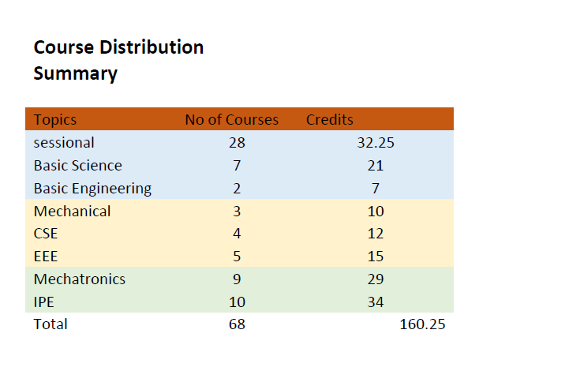
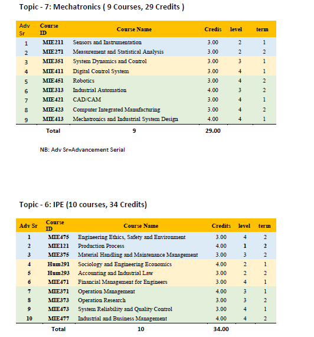

# mie-courses-distribution
The courses included in undergraduate program of Department of Mechatronics and Industrial Engineering (MIE, CUET).  
Courses are grouped by subject groups.  
As of May,2023  
prepared by: masudahmed.cuet2gmail.com  

Total Courses: 68 Courses, 160.25 Credits  
Total Theory: 40 Courses, 128 credits

The courses are sorted here, based on
  -the gradual increase of diificulty 
  -which should come first (prerequisite).
  
(NB: In mechatronics topic the last 5 courses should be sorted as :  
CAD/CAM come first as 5th serial. As it is the entry point.   
Then Industrial Automation. After that we can bring Robotics.  
Only after that we can implement CIM, which gathers all those three things together.  
Lastly the designer level expertise would come to the field, as a closure.)

Includes:
1. A detailed excel file. 
 This can be used to sort, filter or calculate courses as required.  
 There are total 9 sheets. 
  One for all courses
  One for overall distribution of courses by major subject groups.
  And rest 7 sheets are for respective subject groups.
2. A Word document file.
 This word file has 4 pages.
 Presents Summary of the 
 Presents courses by each subject groups in tables ( collected from the excel file )
3. A PDF version of the word file.  

